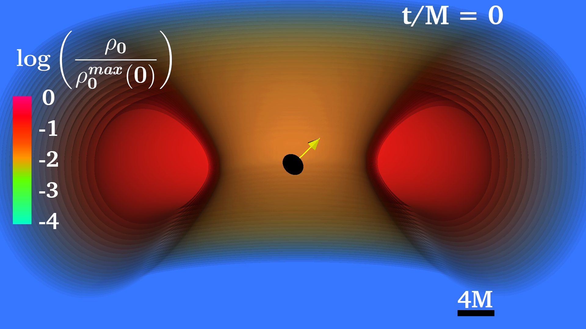
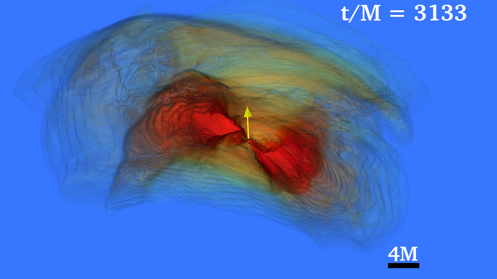

The Illinois Relativity Group carries out full GRMHD simulations of systems with compact objects like black holes and neutron stars. These simulations are carried out over the course of months and output terrabytes of data containing information about the magnetic field, density, and fluid velocity across the entire grid at each time step. To interpret this data and extract the relevant physics from it, it is necessary to create 3D visualizations. They also look really cool. 

#### Gravitational waves ([BHBH movies](https://research.physics.illinois.edu/CTA/movies/BBH_Disk_2023/Gravitational_Waveforms.html), [BHDisk movies](https://research.physics.illinois.edu/CTA/movies/BHDisk_2022/Gravitational_Waveforms.html))
When LIGO detected gravitational waves from a binary black hole merger in 2015, a new lens that we can view the universe through opened up: gravitational wave astronomy. 

Up until 2015, almost all of our knowledge of the universe comes from photons. Stars, dust, and other exotic objects emit photons that travel across the universe and imprint beautiful and revealing images on our eyes and telescopes. By looking at the wavelength spectra, spatial location, and brightness of the photons, we have done amazing science on topics like the life-cycle of stars and the history of the universe. 

Gravitational waves are like photons in the sense that when we detect them, we can record their wavelengths, spatial locations, and brightnesses. However, instead of being waves in the electromagnetic field like photons, gravitational waves are waves in spacetime itself. They travel at the speed of light and pass directly through all matter. When a gravitational wave travels through earth, they make the space and the matter inside it wiggle like jello. However, these gravitational waves, and hence these wiggles, are very small. Very, very, very, very small. The lengths of these wiggles that LIGO measured are around a million times smaller than the size of an atomic nucleus, which is around a million times smaller than the size of an atom, which is around a million times smaller than the thickness of a human hair, which is around a million times smaller than the length of a football field... So yea, detecting gravitational waves is hard, but we've done it!

So what kinds of astrophysical systems emit gravitational waves?

#### Low-mass binary neutron star mergers

#### Accretion disks around tilted binary black holes ([arXiv:2302.09083](https://arxiv.org/abs/2302.09083), [movies](https://research.physics.illinois.edu/CTA/movies/BBH_Disk_2023/index.html))

  |  

#### Tilted self-gravitating black hole-disks ([arXiv:2209.04454](https://arxiv.org/abs/2209.04454), [movies](https://research.physics.illinois.edu/CTA/movies/BHDisk_2022/index.html))

#### Self-consistent magnetars ([arXiv:2111.00013](https://arxiv.org/abs/2111.00013), [movies](https://research.physics.illinois.edu/CTA/movies/SNS_2021/index.html))

Back to [research](../research)

